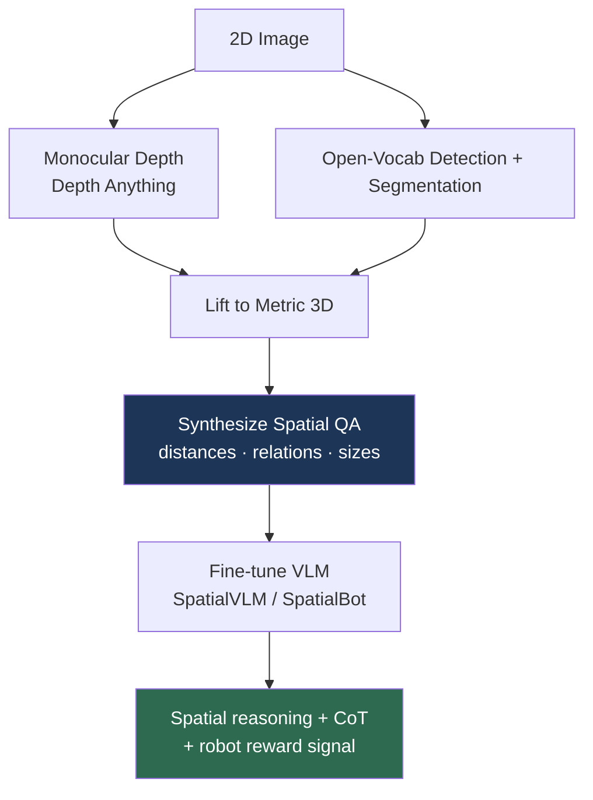

# Spatial Intelligence

> **Last Updated:** June 2026
> **Level:** Research Frontier
> **Related Sections:**
> - [Perception for Robotics](../06_robotics_and_embodied_ai/08_perception_for_robotics.md)
> - [Large Vision-Language Models](../05_multimodal_vision_language/02_large_vision_language_models.md)
> - [4D & Dynamic Scenes](./05_4d_and_dynamic_scenes.md)
> - [Future Trends](./07_future_trends.md)

---

## Overview

"Spatial intelligence" denotes the capacity to perceive, represent, and reason about the geometric and physical structure of the 3D world—relative positions (left/right, above/below, in front/behind), metric distances and sizes, occlusion and containment, and how these change under viewpoint or action. It is the conspicuous failure mode of otherwise impressive large multimodal models: a VLM that can write a sonnet about an image frequently cannot reliably answer whether the mug is to the left or right of the laptop, or which of two objects is closer to the camera. Fei-Fei Li has framed spatial intelligence as the *next frontier* of AI and the founding thesis of World Labs, arguing that language-centric intelligence is fundamentally incomplete without a grounded model of space.

The deficit has a clear cause. Contrastive image-text pretraining (CLIP-style, the backbone of most VLMs—see [Large Vision-Language Models](../05_multimodal_vision_language/02_large_vision_language_models.md)) optimizes for semantic alignment between captions and images. Captions rarely encode precise spatial relations ("a cat" not "a cat 1.2 m left of and nearer than the sofa"), so the learned representations capture *what* is present far better than *where* it is and *how big* it is. Compounding this, 2D image tokens discard the metric depth that spatial reasoning requires. The result is a model that is semantically rich but geometrically impoverished—a critical liability for embodied AI, where every manipulation and navigation decision is fundamentally spatial (see [Perception for Robotics](../06_robotics_and_embodied_ai/08_perception_for_robotics.md)).

This file surveys the diagnosis of the spatial deficit, the data- and architecture-level remedies proposed in 2024–2026 (SpatialVLM, SpatialBot, 3D-LLM, SpatialRGPT), the benchmarks that quantify it, and why solving it is a prerequisite for useful household robots.

---

## The Spatial Deficit: Diagnosis

Spatial reasoning failures fall into several categories: **relational** (left/right, above/below—often near chance because of training-data symmetry and horizontal-flip augmentation that destroys left/right consistency), **metric** (distances, object sizes), **perspective/egocentric** (reasoning from the robot's viewpoint vs. an allocentric map), and **counting** (which degrades with clutter). Benchmarks such as **VSR** (Visual Spatial Reasoning), **What'sUp**, **BLINK**, **SQA3D**, and **EmbodiedScan** isolate these, and consistently show frontier VLMs scoring far below human level on relational and metric items even when they excel at captioning and VQA.

---

## Remedies

### Data Generation: SpatialVLM

**SpatialVLM** [Chen2024] (Google, CVPR 2024) attributes the deficit primarily to a *training-data gap* rather than an architectural limit. Its remedy is a **3D data-generation pipeline**: lift internet images to metric 3D using monocular depth ([Depth Anything](./02_any_model_paradigm.md)-style), open-vocabulary detection, and segmentation, then automatically synthesize millions of spatial QA pairs ("How far is the chair from the table?", "Is the cup left of the plate?"). Fine-tuning a VLM on this synthetic corpus substantially improves quantitative and qualitative spatial reasoning and, notably, enables **chain-of-thought spatial reasoning** and use as a reward signal for robotics.

### Depth-Augmented Architectures: SpatialBot & SpatialRGPT

**SpatialBot** [Cai2024] explicitly feeds *both RGB and depth* to the VLM and trains on a SpatialQA dataset spanning low-to-high-level spatial understanding, arguing that depth must be an *input modality*, not something inferred implicitly. **SpatialRGPT** extends this with region-level 3D representations and a flexible plugin for depth, improving relative-direction and distance estimation.

### Explicit 3D Grounding: 3D-LLM

**3D-LLM** [Hong2023] (NeurIPS 2023) injects 3D point clouds and their features directly into an LLM, training on 3D-language tasks (3D captioning, 3D QA, navigation, embodied dialogue). By grounding the language model in an explicit 3D representation rather than 2D projections, it targets the perspective and metric deficits at their root—at the cost of requiring 3D input that is not always available.

---

## Key Papers

| Paper | Authors | Year | Venue | Key Contribution |
|-------|---------|------|-------|-----------------|
| SpatialVLM | Chen, Xu, Zheng, et al. (Google) | 2024 | CVPR | 3D-grounded synthetic spatial-QA data pipeline |
| SpatialBot | Cai, Liu, et al. | 2024 | arXiv→ICRA | RGB+depth input for precise spatial understanding |
| SpatialRGPT | Cheng, Yin, et al. | 2024 | NeurIPS | Region-level 3D representations + depth plugin |
| 3D-LLM | Hong, Zhen, Chen, et al. | 2023 | NeurIPS | Injects 3D point clouds into LLMs for 3D-language tasks |
| BLINK | Fu, Hu, Li, et al. | 2024 | ECCV | Benchmark exposing VLM perceptual/spatial blind spots |

---

## Benchmark Performance

| Benchmark | Probes | Observation |
|-----------|--------|-------------|
| VSR | 65 spatial relations | Frontier VLMs near chance on many relational items |
| BLINK | Perceptual/spatial | Large human–model gap despite strong VQA scores |
| SQA3D | Situated 3D QA | Egocentric/perspective reasoning remains weak |
| EmbodiedScan | 3D grounding | Multi-modal 3D perception benchmark for embodied AI |
| SpatialVLM eval | Distance/relation QA | Synthetic-data fine-tuning yields large gains |

*Exact leaderboard numbers move quickly; treat specific scores as preliminary and consult current leaderboards.*

---

## Pros & Cons

| Aspect | Pros | Cons |
|--------|------|------|
| Synthetic 3D data (SpatialVLM) | Scales without 3D annotation; large gains | Quality bounded by depth/detector accuracy |
| Depth as input (SpatialBot) | Direct metric grounding | Requires depth sensor/estimator at inference |
| Explicit 3D (3D-LLM) | Root-cause grounding; perspective-aware | Needs 3D input; heavier pipeline |
| 2D-only VLMs | Cheap, ubiquitous | Persistent relational/metric failures |

---

## Open Problems & Research Gaps

- **Egocentric vs. allocentric reasoning.** Robots need viewpoint-dependent spatial reasoning; most benchmarks and fixes target allocentric, third-person relations.
- **Metric grounding from monocular input.** Reliable absolute (not just relative) distance/size from a single RGB image is unsolved at VLM scale.
- **Compositional spatial language.** Chained relations ("the box behind the leftmost cup nearest the window") still break.
- **Dynamic spatial reasoning.** Reasoning about how spatial relations change under the robot's own actions links spatial intelligence to [World Models](../06_robotics_and_embodied_ai/02_world_models.md) and [4D scenes](./05_4d_and_dynamic_scenes.md)—largely unaddressed.
- **Benchmark saturation vs. generalization.** Fine-tuning on synthetic spatial QA can overfit benchmark formats without genuine geometric understanding.
- **Tactile/3D fusion.** Integrating non-visual spatial cues (proprioception, touch) into VLM spatial reasoning is immature.
- **Evaluation of "true" spatial understanding** vs. dataset-pattern exploitation remains an open methodological problem.

---

## Further Reading

- [SpatialVLM (arXiv:2401.12168)](https://arxiv.org/abs/2401.12168) — endowing VLMs with spatial reasoning via synthetic 3D data
- [SpatialBot (arXiv:2406.13642)](https://arxiv.org/abs/2406.13642) — precise spatial understanding with depth input
- [3D-LLM (arXiv:2307.12981)](https://arxiv.org/abs/2307.12981) — injecting 3D into large language models
- [BLINK (arXiv:2404.12390)](https://arxiv.org/abs/2404.12390) — perceptual/spatial blind spots of multimodal LLMs
- [World Labs (Fei-Fei Li)](https://www.worldlabs.ai/) — spatial intelligence as a founding thesis
