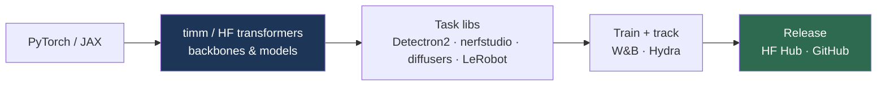

# Software Tools & Frameworks

> **Last Updated:** June 2026
> **Level:** Foundational
> **Related Sections:**
> - [PhD Study Guide](./04_phd_study_guide.md)
> - [Efficient Architectures](../09_efficiency_and_deployment/01_efficient_architectures.md)
> - [Edge Deployment](../09_efficiency_and_deployment/03_edge_deployment.md)

---

## Overview

The productivity of a computer vision researcher is heavily mediated by a mature software stack: deep-learning frameworks, model hubs, domain-specific libraries, and experiment-tracking tools. Fluency with this ecosystem is not incidental—it determines how fast one can implement an idea, reproduce a baseline, and scale an experiment. The stack has consolidated around **PyTorch** as the dominant research framework (with JAX prominent for large-scale and TPU work), **Hugging Face** as the model/dataset distribution hub, and a constellation of task-specific libraries (timm, MMDetection, Detectron2, Open3D, nerfstudio) that package state-of-the-art implementations behind clean APIs.

A second axis is the **reproducibility and infrastructure tooling** that has become research currency in its own right: experiment trackers (Weights & Biases), versioned model hubs, and standardized data formats. Releasing clean, runnable code and pretrained weights through these channels materially increases a paper's impact and citation count (see [PhD Study Guide](./04_phd_study_guide.md)). This file surveys the core tools, what each is for, and how they fit together in a modern CV research workflow. (Tool ecosystems evolve quickly; verify current maintenance status before relying on any single library.)

---

## Deep-Learning Frameworks

- **PyTorch** — the default research framework: eager execution, dynamic graphs, vast ecosystem. `torch.compile` and FSDP/DDP support large-scale training. Nearly all CV research code is PyTorch.
- **JAX** (+ Flax/Haiku) — functional, composable transforms (`grad`, `vmap`, `pmap`, `jit`); dominant for TPU and very-large-scale work (ViT-22B, much of DeepMind's stack). Steeper learning curve, excellent scaling.
- **TensorFlow / Keras** — historically dominant, now mostly in production/legacy and some Google stacks.

## Model Hubs & Backbones

- **Hugging Face Hub** — the central repository for pretrained models, datasets, and Spaces; `transformers`, `diffusers`, `datasets`, `accelerate` libraries. The de-facto distribution channel for foundation models.
- **timm** (PyTorch Image Models) — Ross Wightman's library of hundreds of CV backbones (ViTs, ConvNeXt, EfficientNet) with pretrained weights and a unified API; indispensable for classification/backbone baselines (see [CNN Architectures](../03_architectures/00_cnn_architectures.md)).

## Task-Specific Libraries

- **Detection/Segmentation** — **Detectron2** (FAIR), **MMDetection / MMSegmentation / MMCV** (OpenMMLab), **Ultralytics** (YOLO). Standard implementations and configs.
- **3D & Rendering** — **Open3D** (point clouds/meshes), **PyTorch3D**, **COLMAP** (SfM/MVS), **nerfstudio** (NeRF), **gsplat / 3DGS reference** (Gaussian splatting; see [Gaussian Splatting](../04_3d_vision_and_scene/02_gaussian_splatting.md)).
- **Generative** — **diffusers** (Hugging Face), ComfyUI/AUTOMATIC1111 (Stable Diffusion tooling).
- **Robotics** — **LeRobot** (Hugging Face robot-learning library), **Isaac Lab**, **MuJoCo/MJX**, **robosuite** (see [Simulation and Data](../06_robotics_and_embodied_ai/05_simulation_and_data.md)).

## Experiment & Reproducibility Tooling

- **Weights & Biases (W&B)** — experiment tracking, sweeps, artifact/versioning, dashboards; the most widely used tracker.
- **TensorBoard**, **MLflow**, **Hydra** (config management), **DVC** (data versioning).
- **Papers With Code** — historically the standard SOTA/leaderboard tracker (note: its maintenance status changed in 2025; verify availability).
- **Semantic Scholar / Connected Papers / arXiv** — literature discovery and citation graphs (see [PhD Study Guide](./04_phd_study_guide.md)).

---

## Tool Comparison

| Tool | Category | Best for | Note |
|------|----------|----------|------|
| PyTorch | Framework | General research | Dominant; eager + compile |
| JAX | Framework | Large-scale/TPU | Functional; great scaling |
| Hugging Face | Hub/libs | Model/data distribution | Central ecosystem |
| timm | Backbones | Classification baselines | Hundreds of pretrained models |
| Detectron2/MMDet | Detection | Detection/segmentation | Standard configs |
| nerfstudio/gsplat | 3D | NeRF/3DGS | Reproducible 3D |
| W&B | Tracking | Experiments/sweeps | Industry standard |

---

## Pros & Cons (framework choice)

| Aspect | PyTorch | JAX |
|--------|---------|-----|
| Ease of use | High; large community | Steeper curve |
| Scaling | Strong (FSDP, compile) | Excellent (pmap, TPU) |
| Ecosystem | Vast (timm, HF, Detectron2) | Smaller but growing |
| Debugging | Eager, intuitive | Functional, trickier |

---

## Open Problems & Research Gaps (tooling)

- **Reproducibility gaps.** Code release norms are improving but inconsistent; environment/version drift breaks reproduction.
- **Benchmark tooling fragility.** Leaderboard infrastructure (e.g., Papers With Code changes) is fragile and under-resourced.
- **Compute access.** Tooling assumes GPU/TPU access many researchers lack; democratization is incomplete.
- **Eval standardization.** No universal harness for fair CV/VLM evaluation across labs.
- **Edge/deployment gap.** Bridging research frameworks to optimized edge runtimes remains manual (see [Edge Deployment](../09_efficiency_and_deployment/03_edge_deployment.md)).
- **Robotics tooling immaturity.** Robot-learning software (LeRobot, sim interfaces) is younger and less standardized than core CV.

---

## Further Reading

- [PyTorch](https://pytorch.org/) — the dominant research framework
- [Hugging Face Hub](https://huggingface.co/) — models, datasets, Spaces
- [timm (PyTorch Image Models)](https://github.com/huggingface/pytorch-image-models) — backbone library
- [nerfstudio](https://docs.nerf.studio/) — NeRF/3DGS toolkit
- [Weights & Biases](https://wandb.ai/) — experiment tracking
